# Arquitectura y Análisis Integral de la Base de Datos: TallerMotoCar SaaS

Este documento presenta la radiografía técnica y funcional completa del modelo relacional de **TallerMotoCar**, un sistema SaaS Multi-Tenant para talleres automotrices y de motocicletas.

---

## 1. Diagrama Entidad-Relación Global (Mermaid ERD)

```mermaid
erDiagram
    %% SAAS Y CONFIGURACIÓN
    WORKSHOP ||--o{ WORKSHOP_SETTINGS : "tiene"
    WORKSHOP ||--o{ EMAIL_SETTINGS : "configura"
    WORKSHOP ||--o{ USER : "pertenece"
    WORKSHOP ||--o{ CUSTOMER : "registra"
    WORKSHOP ||--o{ VEHICLE : "atiende"
    WORKSHOP ||--o{ WORK_ORDER : "gestiona"
    WORKSHOP ||--o{ INVENTORY : "almacena"
    WORKSHOP ||--o{ SALE : "factura"

    %% SEGURIDAD Y RBAC
    IDENTIFICATION_TYPE ||--o{ USER : "identifica"
    IDENTIFICATION_TYPE ||--o{ CUSTOMER : "identifica"
    USERROLE ||--o{ USER : "asigna"
    USERROLE ||--o{ ROLEACTION : "posee"
    USERROLE ||--o{ USER_ROLE_MODULE : "accede"
    MODULE ||--o{ ACTION : "contiene"
    OPERATION ||--o{ ACTION : "define"
    ACTION ||--o{ ROLEACTION : "otorga"
    MODULE ||--o{ USER_ROLE_MODULE : "habilita"
    USER ||--o{ LOGIN : "registra"
    USER ||--o{ PASSWORD_RESET_TOKEN : "solicita"

    %% PARQUE AUTOMOTOR
    BRAND ||--o{ BRAND_MODELS : "fabrica"
    BRAND_MODELS ||--o{ BRAND_MODEL_VERSION : "tiene"
    BRAND ||--o{ VEHICLE : "es_marca"
    BRAND_MODELS ||--o{ VEHICLE : "es_modelo"
    BRAND_MODEL_VERSION ||--o{ VEHICLE : "es_version"
    CUSTOMER ||--o{ VEHICLE : "es_propietario"

    %% SERVICIOS Y TARIFAS
    SERVICE_TYPE ||--o{ SERVICE_CATALOG : "clasifica"
    SERVICE_CATALOG ||--o{ SERVICE_PRICE_BY_VERSION : "tarifica"
    BRAND_MODEL_VERSION ||--o{ SERVICE_PRICE_BY_VERSION : "aplica_a"

    %% PRODUCTOS, PROVEEDORES E INVENTARIO
    SUPPLIER ||--o{ INVENTORY_RECEPTION : "suministra"
    PRODUCT_TYPE ||--o{ PRODUCT : "agrupa"
    PRODUCT ||--o{ INVENTORY : "tiene_stock"
    INVENTORY ||--o{ INVENTORY_HISTORY : "audita"
    INVENTORY_RECEPTION ||--o{ INVENTORY_RECEPTION_DETAIL : "detalla"
    PRODUCT ||--o{ INVENTORY_RECEPTION_DETAIL : "recibe"

    %% AGENDA Y CITAS
    AGENDA_SETTINGS ||--o{ AGENDA_DAY_CONFIG : "configura_dias"
    AGENDA_SETTINGS ||--o{ AGENDA_BLOCK : "bloquea"
    CUSTOMER ||--o{ APPOINTMENT : "solicita"
    VEHICLE ||--o{ APPOINTMENT : "agenda"
    SERVICE_CATALOG ||--o{ APPOINTMENT : "reserva"
    APPOINTMENT ||--o| WORK_ORDER : "convierte_en"

    %% CORE OPERATIVO: ÓRDENES DE TRABAJO
    CUSTOMER ||--o{ WORK_ORDER : "solicita"
    VEHICLE ||--o{ WORK_ORDER : "ingresa"
    WORK_ORDER ||--o{ WORK_ORDER_EVIDENCE : "adjunta"
    WORK_ORDER ||--o{ WORK_ORDER_PART : "requiere"
    WORK_ORDER ||--o{ WORK_ORDER_SERVICE : "ejecuta"
    WORK_ORDER ||--o{ WORK_ORDER_HISTORY : "traza"
    PRODUCT ||--o{ WORK_ORDER_PART : "utiliza"
    SERVICE_CATALOG ||--o{ WORK_ORDER_SERVICE : "realiza"
    USER ||--o{ WORK_ORDER_SERVICE : "mecanico_asignado"

    %% FACTURACIÓN Y PAGOS
    WORK_ORDER ||--o| SALE : "origina"
    CUSTOMER ||--o{ SALE : "facturado_a"
    SALE ||--o{ SALE_DETAIL : "contiene"
    SALE ||--o{ SALE_PAYMENT : "recauda"
    PAYMENT_METHOD ||--o{ SALE_PAYMENT : "forma_de_pago"
    PRODUCT ||--o{ SALE_DETAIL : "producto_vendido"
    SERVICE_CATALOG ||--o{ SALE_DETAIL : "servicio_cobrado"

    %% CONTABILIDAD Y MECÁNICOS
    USER ||--o| MECHANIC_PAYMENT_SETTINGS : "configuracion_pago"
    USER ||--o{ MECHANIC_PAYMENT_SETTLEMENT : "recibe_pago"
```

---

## 2. Los 9 Dominios Funcionales de la Base de Datos

### Dominio 1: SaaS Multi-Tenant & Identidad del Taller
- **`workshop`**: Representa la cuenta o suscripción del taller. Contiene tipo de taller (`moto`, `car`, `multi`), estado del plan y días de prueba.
- **`workshop_settings`**: Almacena configuración clave-valor por taller (logo base64, marcas comerciales, eslogan, datos tributarios).
- **`email_settings`**: Configuración SMTP para envío automático de facturas, cotizaciones y recordatorios de citas.

> **Principio de Aislamiento**: Cada tabla transaccional y de catálogo posee la columna `workshop_id`. En el backend, Entity Framework aplica *Global Query Filters* automáticos evaluados en tiempo de ejecución para evitar cualquier fuga de datos entre talleres.

---

### Dominio 2: Seguridad y Control de Acceso Granular (RBAC Dinámico)
- **`identification_type`**: Tipos de documento (CC, NIT, CE, Pasaporte).
- **`userrole`**: Roles de usuario (SuperAdmin, Administrador, Mecánico, Cliente).
- **`user`**: Empleados, administradores y mecánicos del taller.
- **`module`**, **`operation`**, **`action`**: Matriz de permisos desacoplada. Un módulo (ej. `Ordenes Trabajo`) se cruza con operaciones (`Ver`, `Guardar`, `Editar`, `Inactivar`) generando `slugs` únicos (ej. `Guardar_Ordenes_Trabajo`).
- **`roleaction`** y **`user_role_module`**: Asignación de permisos específicos por rol para el menú lateral y las acciones del frontend.
- **`login`** y **`password_reset_token`**: Auditoría de accesos e inicio de sesión y recuperación segura de contraseñas con expiración por token.

---

### Dominio 3: Parque Automotor y Jerarquía Vehicular
- **`brand`**: Marcas de vehículos (Yamaha, Honda, Suzuki, Bajaj, Chevrolet, Renault, etc.).
- **`brand_models`**: Modelos específicos (ej. MT-09, FZ-25, Spark GT, Logan).
- **`brand_model_version`**: Versión, cilindraje y motorización (ej. 2024 ABS 890cc).
- **`customer`**: Clientes del taller con datos de contacto (teléfono, correo, dirección).
- **`vehicle`**: Vehículo físico vinculado a un cliente. Contiene placa única, color, kilometraje actual y tipo de vehículo (`moto` o `car`).

---

### Dominio 4: Catálogo de Servicios y Matriz Tarifaria por Versión
- **`service_type`**: Categorías de mano de obra (Mantenimiento Preventivo, Frenos, Motor, Eléctrico).
- **`service_catalog`**: Lista maestra de servicios con precio base por defecto y duración estimada en minutos.
- **`service_price_by_version`**: **Tarificación diferenciada**. Permite que un mismo servicio (ej. "Sincronización") tenga un precio base estándar, pero un precio superior para motos de alto cilindraje o carros específicos.

---

### Dominio 5: Inventario, Productos y Recepciones de Mercancía
- **`product_type`**: Categorías de repuestos (Aceites, Filtros, Pastillas de Freno, Llantas).
- **`product`**: Repuestos con referencia, código de barras, precio base (costo) y precio de venta sugerido.
- **`supplier`**: Proveedores de repuestos y suministros.
- **`inventory`**: Stock disponible por producto (`stock_quantity`, `minimum_stock`, `maximum_stock`).
- **`inventory_history`**: Kardex / auditoría de cada movimiento (Entrada por compra, Salida por venta/OT, Ajuste manual).
- **`inventory_reception`** y **`inventory_reception_detail`**: Órdenes de entrada de mercancía con cálculo de costo promedio y actualización automática del inventario.

---

### Dominio 6: Core Operativo (Órdenes de Trabajo)
El corazón de la operación del taller:
- **`work_order`**: Cabecera de la orden. Contiene placa/vehículo, cliente, fecha de ingreso, fecha estimada de entrega, kilometraje, nivel de gasolina (`fuel_level`), abono inicial (`down_payment`), observaciones y estado actual.
  - **Flujo de Estados**: `Recepción` $\rightarrow$ `Cotización` $\rightarrow$ `Aprobado` $\rightarrow$ `Terminado` $\rightarrow$ `Entregado` (o `Cancelada`).
- **`work_order_evidence`**: Fotos del estado físico del vehículo (rayones, golpes, evidencias de ingreso y salida).
- **`work_order_part`**: Repuestos cargados a la orden.
  - Diferencia entre repuestos propios con stock, repuestos bajo pedido y repuestos suministrados por el cliente (`is_provided_by_customer`).
- **`work_order_service`**: Servicios asignados a mecánicos específicos con su respectivo precio y estado de aprobación.
- **`work_order_history`**: Trazabilidad temporal de cambios de estado y fechas de finalización.

---

### Dominio 7: Agenda y Agendamiento Online (Portal Cliente)
- **`agenda_settings`**: Horarios de atención del taller, tiempo promedio por turno y capacidad simultánea de elevadores/bahías.
- **`agenda_day_config`**: Horarios personalizados por día de la semana (Lunes a Sábado, descanso en Domingo).
- **`agenda_block`**: Bloqueos de agenda (festivos, mantenimiento de taller, ausencias).
- **`appointment`**: Citas agendadas por el cliente o recepción.
  - Al recibir la moto/carro en el taller, la cita se convierte automáticamente en una `work_order` preservando los datos del cliente y vehículo.

---

### Dominio 8: Facturación, Medios de Pago y Auditoría de Ventas
- **`payment_method`**: Medios de pago aceptados (Efectivo, Transferencia Bancaria, Nequi, Daviplata, Tarjeta Débito/Crédito).
- **`sale`**: Factura/comprobante final de la orden. Registra subtotal, descuento aplicado, abono descontado, saldo cobrado y observaciones de garantía.
- **`sale_detail`**: Desglose de cada repuesto y servicio facturado.
- **`sale_payment`**: Desglose financiero exacto de los montos recaudados por cada método de pago con su número de comprobante o referencia.

---

### Dominio 9: Contabilidad y Liquidación de Mecánicos
- **`mechanic_payment_settings`**: Define cómo gana cada mecánico:
  - **Porcentaje**: Comisión sobre la mano de obra de los servicios aprobados que completó (ej. 40%, 50%).
  - **Por Día**: Pago fijo por jornada trabajada en el taller.
- **`mechanic_payment_settlement`**: Historial de nómina/liquidaciones pagadas al mecánico con fecha de corte y comprobante.

---

## 3. Puntos Críticos y Reglas de Oro Arquitectónicas

> [!IMPORTANT]
> **1. Aislamiento Estricto de Datos (Multi-Tenant)**
> Nunca ejecutar consultas `raw SQL` sin incluir la condición `WHERE workshop_id = @tenantId`. En Entity Framework Core, los `HasQueryFilter` garantizan esto automáticamente.

> [!WARNING]
> **2. Inmutabilidad de Facturas Generadas**
> Una vez creada la factura en `sale`, la orden de trabajo (`work_order`) queda bloqueada contra modificaciones operativas de precios, repuestos o servicios para evitar inconsistencias contables o fraudes de caja.

> [!TIP]
> **3. Cálculo Financiero de Ganancia Neta Real**
> El panel de **Control de Ventas** separa con exactitud:
> - **Repuestos con Stock**: Generan margen comercial $= \text{Venta} - \text{Costo Base}$.
> - **Repuestos Bajo Pedido**: Generan margen $= \text{Venta} - \text{Costo Adquisición}$.
> - **Cotizaciones Externas**: Pase directo sin margen (se cobran al cliente exactamente al costo del tercero).
> - **Mano de Obra Neta**: Total Facturado en Servicios menos la Comisión/Honorarios del mecánico.

---

## 4. Guía de Reseteo y Re-inicialización de la Base de Datos

Para vaciar por completo la base de datos sin borrar las tablas ni correr migraciones de nuevo:

1. **Ejecutar el script de vaciado**:
   - Abrir y ejecutar: [`ResetDatabaseData.sql`](file:///c:/Users/migue/Documents/Proyecto%20PWA/Api/ApiTaller.Infrastructure/Helpers/ResetDatabaseData.sql).
   - Este script utiliza `SET FOREIGN_KEY_CHECKS = 0;` y ejecuta `TRUNCATE TABLE` en las 41 tablas, reseteando los contadores autoincrementales a 1.
2. **Ejecutar el script maestro de datos**:
   - Abrir y ejecutar: [`SeedInitialComplete.sql`](file:///c:/Users/migue/Documents/Proyecto%20PWA/Api/ApiTaller.Infrastructure/Helpers/SeedInitialComplete.sql).
   - Poblará la base de datos con el taller principal, catálogo completo de motos y carros, catálogo de servicios, inventario inicial, usuarios administradores y roles RBAC.
