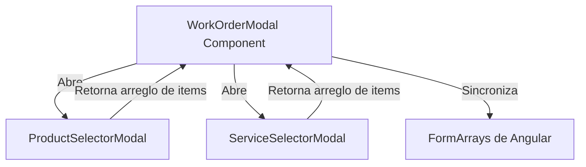

# Plan de Implementación - Modales Premium de Selección Múltiple (Repuestos y Servicios)

Este plan describe el diseño e implementación de dos modales premium de selección múltiple interactiva para agregar **Repuestos / Partes** y **Servicios / Mano de Obra** en las órdenes de trabajo. Esto reemplazará las listas desplegables convencionales (selects) por un flujo moderno, altamente responsivo, rápido y con buscador integrado, ideal tanto para ordenadores como para dispositivos móviles.

---

## Diseño Visual y Experiencia de Usuario (UX Premium)

### 1. Modal de Selección de Repuestos (`ProductSelectorModal`)
* **Buscador Reactivo**: Un campo de texto elegante en la cabecera con icono de lupa, que filtra el catálogo de repuestos instantáneamente al escribir.
* **Filtros Rápidos (Categorías)**:
  * **Todos**: Muestra el catálogo completo.
  * **Con Stock**: Muestra repuestos disponibles inmediatamente.
  * **Sin Stock (Requiere Compra)**: Muestra repuestos agotados.
  * **Externos**: Permite agregar un ítem "Repuesto Externo / Sin Stock" de forma directa.
* **Cuadrícula de Tarjetas (Responsive Grid)**:
  * Cada repuesto se presenta en una tarjeta elegante con fondo de cristal (`glass-card`).
  * **Detalles**: Nombre del repuesto, código, referencia, y precio formateado en pesos colombianos (`COP`).
  * **Badge de Stock**:
    * Verde si hay stock suficiente (`> 5 unidades`).
    * Amarillo si queda poco stock (`1 - 5 unidades`).
    * Rojo/Alerta si no hay stock (`Agotado — Requiere Compra`).
  * **Selector de Cantidades Interactivo**:
    * Inicialmente muestra un botón `+ Agregar`.
    * Al pulsarlo, se transforma en un control interactivo `- 1 +` con animación de transición, borde brillante en color cyan y fondo con un sutil gradiente.
    * Permite aumentar o disminuir la cantidad rápidamente.

### 2. Modal de Selección de Servicios (`ServiceSelectorModal`)
* **Buscador Integrado**: Filtra el catálogo de servicios de mano de obra por nombre o descripción.
* **Segmentación por Tipo de Servicio (Tabs de Categorías)**:
  * Cargará dinámicamente los tipos de servicio disponibles (ej: *Mantenimiento*, *Eléctrico*, *Mecánica General*) en pestañas o chips horizontales interactivos. Al pulsar un chip, la lista se filtrará instantáneamente.
* **Cuadrícula de Tarjetas de Servicios**:
  * Muestra el nombre del servicio, la categoría y la duración estimada (ej: *45 Min*, *2 Hrs*).
  * **Resolución Inteligente de Precios**:
    * El modal recibirá los precios configurados para la marca/modelo/versión de la moto actual.
    * Si el servicio posee un precio específico para esa moto, mostrará un badge premium en color verde/cyan: `🚗 Precio personalizado para este modelo`.
    * Si no, mostrará el precio estándar del catálogo.
  * **Selector de Cantidades**: Mismo componente interactivo `- / +` para permitir al mecánico agregar varios servicios a la vez o el mismo servicio repetido.

### 3. Pie de Página (Acción Principal)
* Un botón principal premium, flotante y ancho en la parte inferior: **"Añadir Seleccionados (X elementos)"**.
* Muestra de forma dinámica la suma de elementos elegidos y aplica un efecto de brillo (`glow`) cuando hay al menos 1 seleccionado.

---

## Cambios Propuestos en Componentes



### Componente Principal: `WorkOrderModal`

#### [MODIFY] [work-order-modal.html](file:///c:/Users/miguelagutierrezg/Proyectos/Front/TallerMotoApp/src/app/features/work-orders/components/work-order-modal/work-order-modal.html)
* Reemplazar los botones convencionales de agregar filas por llamadas a `openProductSelector()` y `openServiceSelector()`.
* Rediseñar la sección de filas agregadas para que sirvan de **resumen y ajuste final** (donde se puede ver la lista final, ajustar precios de forma excepcional, asignar mecánicos específicos a cada servicio, ver checks de aprobación y eliminar si es necesario). Esto elimina el ruido visual de tener desplegables abiertos dentro de las tablas y da una visualización premium y ordenada.

#### [MODIFY] [work-order-modal.ts](file:///c:/Users/miguelagutierrezg/Proyectos/Front/TallerMotoApp/src/app/features/work-orders/components/work-order-modal/work-order-modal.ts)
* Declarar los métodos `openProductSelector()` y `openServiceSelector()`.
* Al cerrarse la modal de selección, recibir el listado de productos/servicios con sus cantidades correspondientes.
* Recorrer el listado de forma eficiente y mapearlo a las funciones existentes `addPart()` y `addService()`, poblando los arreglos de formulario dinámicos de Angular (`FormArray`).

---

### Nuevos Componentes de Selección

#### [NEW] [product-selector-modal.ts](file:///c:/Users/miguelagutierrezg/Proyectos/Front/TallerMotoApp/src/app/features/work-orders/components/product-selector-modal/product-selector-modal.ts)
* Archivo lógico en Angular standalone.
* Recibirá el catálogo de productos a través de `MAT_DIALOG_DATA`.
* Controlará los filtros por texto y por chips de stock/inventario.
* Mantendrá un objeto interno de selección: `selectedMap: { [productId: number]: number }` (ID del producto mapeado a la cantidad seleccionada).

#### [NEW] [product-selector-modal.html](file:///c:/Users/miguelagutierrezg/Proyectos/Front/TallerMotoApp/src/app/features/work-orders/components/product-selector-modal/product-selector-modal.html)
* Contenedor de cristal templado (`glass-dialog`) y cabecera moderna.
* Buscador integrado.
* Fila de chips de categorías.
* Scroll infinito o contenedor con scroll fluido y scrollbars curvos estilizados.
* Grid responsivo adaptado para verse perfecto en pantallas táctiles de teléfonos celulares.

#### [NEW] [product-selector-modal.scss](file:///c:/Users/miguelagutierrezg/Proyectos/Front/TallerMotoApp/src/app/features/work-orders/components/product-selector-modal/product-selector-modal.scss)
* Estilos CSS/SCSS puros con variables de tema oscuro.
* Animaciones de hover en las tarjetas, efecto de borde de gradiente y transformaciones suaves en los selectores de cantidad.

#### [NEW] [service-selector-modal.ts](file:///c:/Users/miguelagutierrezg/Proyectos/Front/TallerMotoApp/src/app/features/work-orders/components/service-selector-modal/service-selector-modal.ts)
* Archivo lógico en Angular standalone.
* Recibirá el catálogo de servicios, tipos de servicio y precios específicos de la versión.
* Controlará los filtros de tipo de servicio (categorías) y de buscador textual.
* Resolverá dinámicamente si mostrar el precio base o el precio personalizado de la matriz del taller.

#### [NEW] [service-selector-modal.html](file:///c:/Users/miguelagutierrezg/Proyectos/Front/TallerMotoApp/src/app/features/work-orders/components/service-selector-modal/service-selector-modal.html)
* Interfaz premium con selector de categorías tipo "chips deslizantes", excelente para dedos en smartphones.
* Buscador textual rápido.
* Visualización en tarjetas con duración de servicio estilizada e indicadores de precio matriz.

#### [NEW] [service-selector-modal.scss](file:///c:/Users/miguelagutierrezg/Proyectos/Front/TallerMotoApp/src/app/features/work-orders/components/service-selector-modal/service-selector-modal.scss)
* Hoja de estilos con variables de HSL para animaciones micro-interactivas premium.

---

## Plan de Verificación y Control de Calidad

### Pruebas Automatizadas/Compilación
- Correr `ng build` para asegurar la correcta compilación de los módulos e importaciones standalone de Angular.

### Pruebas Manuales y UX (Desktop & Mobile viewports)
1. **Flujo de Repuestos**:
   * Abrir la modal de selección.
   * Escribir en el buscador (ej: "filtro") y comprobar filtrado instantáneo.
   * Alternar pestañas de stock.
   * Aumentar cantidades de múltiples productos y verificar el cambio dinámico del contador en el botón de confirmación.
   * Confirmar la selección y comprobar que en la ventana principal de la Orden de Trabajo aparecen correctamente cargados los repuestos en las filas finales de cotización.
2. **Flujo de Servicios**:
   * Abrir la modal de servicios.
   * Comprobar que los chips de categorías se cargan y filtran la lista al pulsarlos.
   * Verificar la visualización del badge de "Precio personalizado" si la moto tiene una marca/modelo con precio configurado en la matriz.
   * Añadir varios servicios y confirmar. Validar la inserción en la grilla principal del taller.

---

# Fase 11 — Portal del Cliente: Compatibilidad Total Móvil y Tablet

## Descripción del Problema

El portal tiene **dos rutas distintas** para clientes:

1. **`/home/my-vehicles`** → Usa el `AppLayout` (sidebar + topbar de admin). Las páginas `MyVehicles`, `MyOrders`, `OrderDetail`, `MyAppointments` viven aquí.
2. **`/portal/dashboard`** → Usa componentes totalmente independientes (`CustomerDashboardMobileComponent`, `OrderDetailMobileComponent`, etc.) con su propio diseño móvil nativo.

El problema es que **el path `/home/...` (AppLayout) no está optimizado para móvil/tablet cuando el usuario es cliente**. El layout del admin (sidebar colapsable, topbar con badges) se usa para mostrar el portal del cliente, lo que genera una UX confusa y rota en pantallas pequeñas.

---

## Diagnóstico Completo: Bugs e Issues por Área

### 🔴 BUG CRÍTICO: Rutas inexistentes en `MobileBottomNav`

El componente [mobile-bottom-nav.ts](file:///c:/Users/miguelagutierrezg/Proyectos/Front/TallerMotoApp/src/app/features/portal-mobile/components/mobile-bottom-nav/mobile-bottom-nav.ts) referencia dos rutas que **NO EXISTEN** en el router:

```
/portal/vehicles   → ❌ No existe ninguna ruta con este path
/portal/appointments → ❌ No existe ninguna ruta con este path
```

Las rutas reales del portal son: `/portal/dashboard`, `/portal/orders/:id`, `/portal/orders/:id/approve`. Esto significa que el nav bar de la app móvil tiene dos botones que llevan a una página de error `404` → redirige a `/login`.

### 🟠 BUG MAYOR: Portal `/home/...` muestra layout de admin en móvil

Cuando un cliente accede desde móvil a `/home/my-vehicles`, ve:
- La **topbar de administrador** (con "Centro de control", "Gestiona la operación…") — texto incorrecto para un cliente.
- El **menú hamburguesa** que abre el sidebar, que para un cliente solo muestra "Mis Motos" y "Mis Citas", pero el sidebar tiene la estética y estructura pensada para admins.
- En móvil, el botón "Vincular Nueva Moto" en `my-vehicles.html` puede quedar fuera del área visible si el hero hace wrap.

### 🟠 BUG MAYOR: `my-orders.html` — Tabla inutilizable en móvil

La tabla `data-table` en [my-orders.html](file:///c:/Users/miguelagutierrezg/Proyectos/Front/TallerMotoApp/src/app/features/customer-portal/pages/my-orders/my-orders.html) tiene **8 columnas** (`N° Orden`, `Fecha Ingreso`, `Entrega Est.`, `Estado`, `Total Repuestos`, `Total Servicios`, `Gran Total`, `Acción`). En móvil, aunque `.table-responsive` agrega scroll horizontal, la experiencia de usuario es pésima — el usuario no sabe que puede hacer scroll horizontal y las celdas se ven muy pequeñas.

### 🟠 BUG MAYOR: `order-detail.html` — Botones de acción se colapsan en header

En [order-detail.html](file:///c:/Users/miguelagutierrezg/Proyectos/Front/TallerMotoApp/src/app/features/customer-portal/pages/order-detail/order-detail.html) (líneas 40-57), el `div` de `display: flex; justify-content: space-between` con los botones `Historial`, `Evidencias`, `Factura` queda aplastado junto al título de sección cuando la pantalla es pequeña. No hay `flex-wrap` ni breakpoint para columnas.

### 🟡 ISSUE MENOR: `my-appointments.html` — Usa inline styles en lugar de clases

[my-appointments.html](file:///c:/Users/miguelagutierrezg/Proyectos/Front/TallerMotoApp/src/app/features/customer-portal/pages/my-appointments/my-appointments.html) tiene decenas de `style="..."` inline en cada elemento. Esto es difícil de mantener y en móvil el grid de `minmax(350px, 1fr)` puede no reducirse correctamente a 1 columna en pantallas `< 375px`.

### 🟡 ISSUE MENOR: `order-detail.html` — Banner de alerta con inline styles no responsive

El banner de la línea 20 en `order-detail.html` usa `style="margin: 20px 20px 0 20px; display: flex; align-items: center; gap: 15px;"`. En móvil esto no hace wrap, y el ícono + texto se comprimen. Falta `flex-wrap: wrap`.

### 🟡 ISSUE MENOR: Topbar muestra "Centro de control / Gestiona operación" para clientes

En [app-layout.html](file:///c:/Users/miguelagutierrezg/Proyectos/Front/TallerMotoApp/src/app/features/layout/pages/app-layout/app-layout.html) (líneas 475-478), el topbar siempre muestra `"Dashboard"` y `"Centro de control"`, `"Gestiona la operación diaria"` — esto no tiene sentido para un cliente.

### 🟡 ISSUE MENOR: `my-orders.html` — Hero con placa se deforma en pantallas estrechas

Cuando `vehiclePlate` tiene 6+ caracteres y se muestra en `<h1>` junto al `—` y la placa destacada, en pantallas `< 360px` el título hace wrap a 3 líneas.

---

## Cambios Propuestos

### Componente 1: Fix Crítico — Rutas inexistentes en MobileBottomNav

---

#### [MODIFY] [mobile-bottom-nav.ts](file:///c:/Users/miguelagutierrezg/Proyectos/Front/TallerMotoApp/src/app/features/portal-mobile/components/mobile-bottom-nav/mobile-bottom-nav.ts)

- Cambiar `/portal/vehicles` → `/portal/dashboard` (o eliminar este ítem, puesto que no hay una página de vehículos en el portal mobile)
- Cambiar `/portal/appointments` → eliminar o redirigir a una página existente
- El nav quedará: `Inicio (/portal/dashboard)` | `Órdenes (activas)` | `Salir`

---

### Componente 2: Topbar adaptativa para el rol Cliente

---

#### [MODIFY] [app-layout.html](file:///c:/Users/miguelagutierrezg/Proyectos/Front/TallerMotoApp/src/app/features/layout/pages/app-layout/app-layout.html)

- Detectar `canShowClientPortal()` y mostrar un topbar diferente:
  - Texto: `"Mi Portal"` / `"Bienvenido a tu espacio personal"`
  - Ocultar el badge `"Sistema activo"` para clientes
  - Mostrar "Cliente" en el chip de usuario (ya está implementado, solo asegurar la lógica)

---

### Componente 3: `my-orders` — Rediseño mobile-first con cards

---

#### [MODIFY] [my-orders.html](file:///c:/Users/miguelagutierrezg/Proyectos/Front/TallerMotoApp/src/app/features/customer-portal/pages/my-orders/my-orders.html)

- **En móvil** (< 768px): Reemplazar la tabla de 8 columnas con **tarjetas verticales** tipo card (una por orden). Cada card muestra: N° orden, estado chip, fecha, gran total, y botón "Ver detalle".
- **En tablet/desktop**: Mantener la tabla existente con scroll.
- Usar `@media` queries o clases condicionales en Angular para alternar entre tabla y cards.

#### [MODIFY] [my-orders.scss](file:///c:/Users/miguelagutierrezg/Proyectos/Front/TallerMotoApp/src/app/features/customer-portal/pages/my-orders/my-orders.scss)

- Agregar estilos de `.order-card-mobile` para el diseño en tarjetas.
- Agregar breakpoint `@media (max-width: 767px)` para ocultar la tabla y mostrar las cards.

---

### Componente 4: `order-detail` — Header de acciones responsive

---

#### [MODIFY] [order-detail.html](file:///c:/Users/miguelagutierrezg/Proyectos/Front/TallerMotoApp/src/app/features/customer-portal/pages/order-detail/order-detail.html)

- Convertir el `div` de botones de acción (líneas 40-56) a `flex-wrap: wrap; gap: 8px` para que en móvil los botones bajen a la siguiente línea.
- Convertir el banner de alerta (línea 20) para que haga wrap correctamente.

#### [MODIFY] [order-detail.scss](file:///c:/Users/miguelagutierrezg/Proyectos/Front/TallerMotoApp/src/app/features/customer-portal/pages/order-detail/order-detail.scss)

- Agregar `.order-detail-actions` con estilos responsive.

---

### Componente 5: `my-appointments` — Limpiar inline styles

---

#### [MODIFY] [my-appointments.html](file:///c:/Users/miguelagutierrezg/Proyectos/Front\TallerMotoApp\src\app\features\customer-portal\pages\my-appointments\my-appointments.html)

- Mover todos los `style="..."` inline a clases CSS en un archivo `.scss` dedicado.
- Asegurar que el grid de citas use `minmax(300px, 1fr)` en lugar de `minmax(350px, 1fr)` para mejor adaptación en móvil.

#### [NEW] [my-appointments.scss](file:///c:/Users/miguelagutierrezg/Proyectos/Front/TallerMotoApp/src/app/features/customer-portal/pages/my-appointments/my-appointments.scss)

- Crear archivo SCSS con todas las clases necesarias, incluyendo breakpoints para móvil.

---

### Componente 6: `my-vehicles` — Hero actions responsive

---

#### [MODIFY] [my-vehicles.scss](file:///c:/Users/miguelagutierrezg/Proyectos/Front/TallerMotoApp/src/app/features/customer-portal/pages/my-vehicles/my-vehicles.scss)

- Ya tiene `@media (max-width: 640px) { .vehicles-grid { grid-template-columns: 1fr; } }` — verificar si funciona correctamente.
- Agregar breakpoints para `.vehicle-card__actions` en pantallas muy pequeñas (`< 360px`): apilar los botones verticalmente.

---

## Plan de Verificación

### Compilación
- `ng build` sin errores después de todos los cambios.

### Pruebas manuales (responsive)
1. **Móvil (375px)**: Verificar portal `/portal/dashboard` — bottom nav funcional, sin links rotos.
2. **Móvil (375px)**: Verificar `/home/my-vehicles` — grid de 1 columna, hero sin desbordamiento.
3. **Móvil (375px)**: Verificar `/home/my-vehicles/:id/orders` — cards en lugar de tabla.
4. **Móvil (375px)**: Verificar `/home/my-vehicles/:id/orders/:id` — botones de acción en columna, banner sin desbordamiento.
5. **Tablet (768px)**: Verificar que la tabla de órdenes aparece correctamente (no las cards).
6. **Tablet (768px)**: Verificar sidebar colapsado y menú hamburguesa funcional.
7. **Portal móvil**: Verificar que todos los links del bottom nav llevan a rutas existentes.

